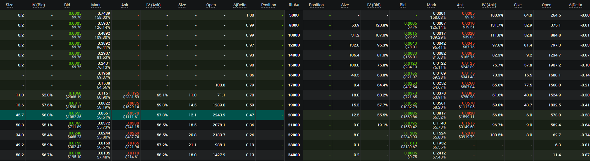

Option Box strategy can be constructed via Bull Call Spread + Bear Put Spread

### Bull Call Spread:

Buy 1 ITM Call and Sell 1 OTM Call (long Box)

or

Sell 1 ITM Call and Buy 1 OTM Call (short Box)

### Bear Put Spread: 

Buy 1 ITM Put and Sell 1 OTM Put (long Box)

or

Sell 1 ITM Put and Buy 1 OTM Put (short Box)

From the below chart of the market data, the short Box is undervalued and arbitrage can be conducted.

All using taking:

1590-1111=479

1569-1112=457

(479+457-1000)/1000*1e4 = -6.4% 

Bitcoin option, spot@19450, as of 2022-10-23 21:00:00

## Execution:
The execution of such arbitrage strategy is another topic. It include 2 pairs of executions. When the spread is large enough, we could do 4 taking. When the spread is not too wide or taking is expensive, maker can be used
