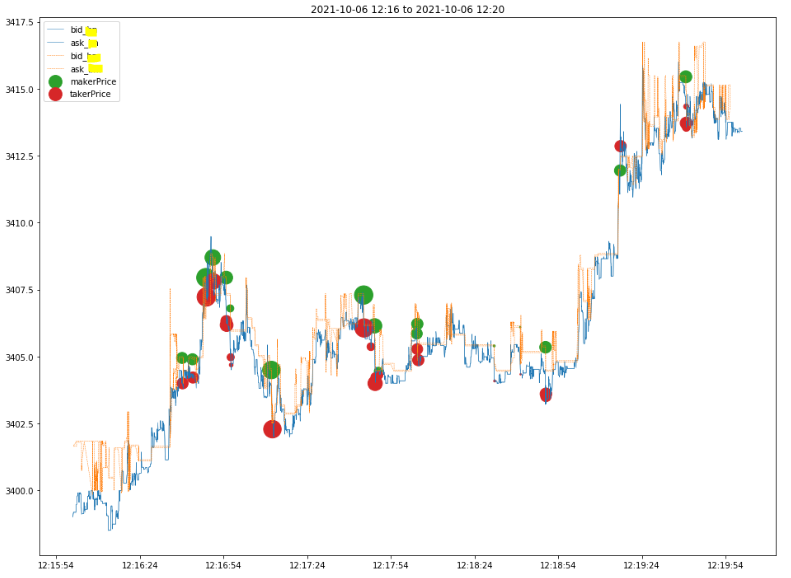
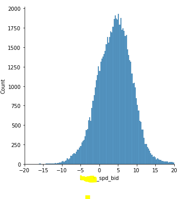

## A market neutral arbitrage on cross Exchange price difference

We often find that the price of similar/same contract on different exchanges are not in sync. Such out of sync can be quite persistent.

Below Pic 1 is an example of such out of sync between 2 exchanges, both are ETH-PERP. 

Such price out fo sync are varying over the time. Pic 2 shows such price difference over a period of 10 days.

When such price diff is large, we could post a passive Buy on Exchange A, once it's filled, we immediately sell on Exchange B using market order.

We do the opposite when the price diff is small. Theortically, if we could capture the spread of 12bps(target) then hedge it back when it's 0bps, the net profit is 12bps - fee(4bps) = 8bps.

Pic 1 is also an empirical execution of such strategy.

### Pic 1

### Pic 2

In a nutshell, this strategy exploits the price difference between 2 exchanges. When the price difference is large, we capture the price diff. When the diff narrows, we clear out our position. 
We are market neutral during the whole process.

## Execution
The execution of such strategy includes 2 pairs of making-taking executions. It's very positive that market moves when our maker got a fill, which deteriorates our profit or even incur loss. Empirically we observed slippage of 5bps, which can still be improved with quantitative method, e.g., signals.
