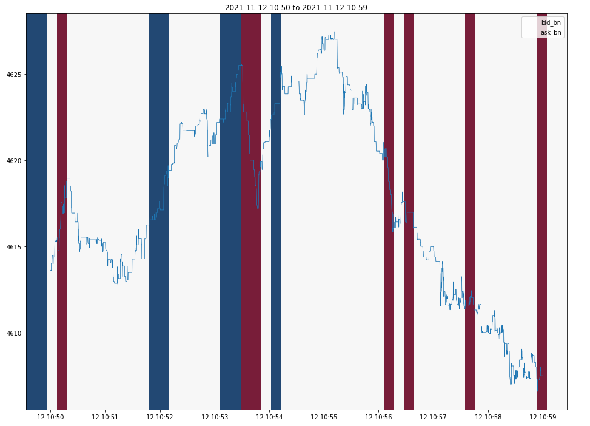

## A short term alpha signal

We are also testing a short term alpha signal based on the mid price of ETH-PERP on Binance, which is mainly trained based on momentum and other simple orderbook characteristics. 

we are able to get the correct sign 82%(using a NN model), or 79% (linear model) for the next 10 sec.

### illustration:

Red: predicted price drop

Blue: predicted price rise

### Usage and Caveat

Although this signal has good prediction power in the price direction, it does not perform well enough to be profitable on itself(in the 10 days dataset we have). A much longer dataset is required to test the profitability and risk control. Given taking is usually required to capture such short term and it can easily cost > 5bps, this also becomes a hurdle. However, such signal might be useful in combination with the previous 2 strategies to minimize the executioin slippage. 
