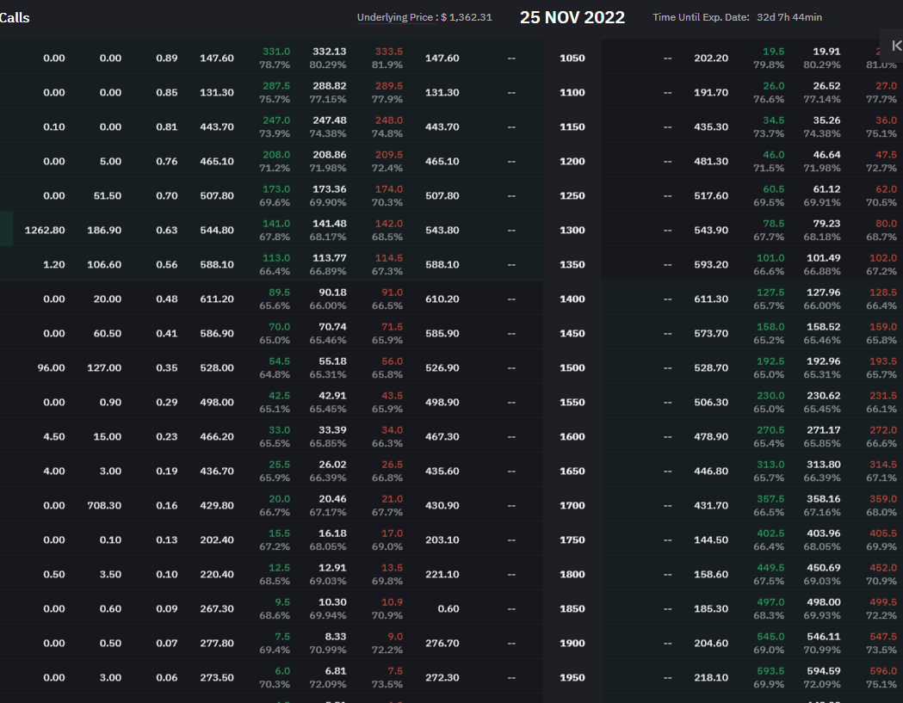

## A market neutral arbitrage on options' spread

We observed options on Deribit Exchange have wider spread than other exchanges e.g., Bybit Exchange. 

The below snapshot of market data is an example:

Deribit:
ETH-25NOV22-1350-C Bid vs Ask: 111.71 vs 114.44

Bybit:
ETH-25NOV22-1350-C Bid vs Ask: 113 vs 114.5

ETH spot@1362, as of 2022-10-23 23:30:00
 

Given the wide spread on Deribit, we could post a passive Buy on Deribit @111.71, once it's filled, we immediately sell on Bybit using market order.

Theoretically, the profit is (113 - 111.71) / 111.71 - fees = 115bps - 1bps = 114bps

Likewise, also to manamge the position both on the 2 exchanges, similar arbitrage can be conducted on the bid side. 

The theoretical profit is (114.5 - 114.44) / 114.44 - fees = 5bps - 1bps = 4bps

Ideally we don't have to hedge it back right away. We can always wait until the ask side price in our favour, but even in this example, it does not cost us to clear our position on both exchanges. And we maintain market neutral during the whole process.

In a nutshell, we want to capture the spread of 240bps on Deribit and hedge that by trading on Bybit, paying 130bps. 

### Deribit ETH-25NOV22-1350-C

### ByBit ETH-25NOV22-1350-C

## Execution & Caveat:
The execution of such arbitrage strategy is another topic. It include 2 pairs of making-taking executions. It's very positive that market moves when our maker got a fill, which deteriorates our profit or even incur loss. We call it execution slippage. Market condition, speed, exchange microstructure all contributes to such slippage. We will need to conduct research on large sample of market data and our own execution to optimize it. 

The caveat is, there may not be too much liquidity on the option market all the time, especially on Deribits, so maybe that's why the spread is wide. This is affecting the scale of the profit. The margin requirement could be high for option trading, especially short selling. 
